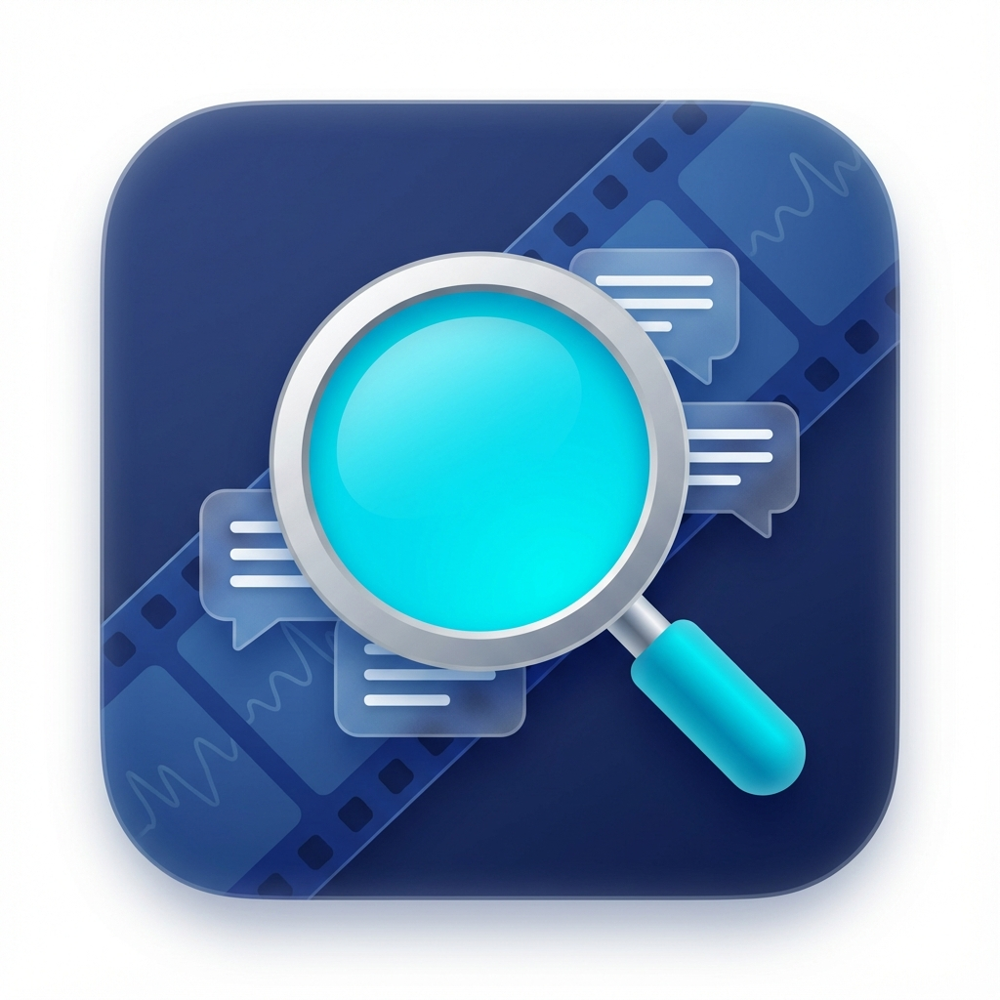

# kaoche-pro

**一个烤肉工具箱 | Next-Gen Subtitle Productivity Suite**




**kaoche-pro** 是一个基于 AI 驱动的专业级字幕处理桌面应用。它采用现代化的插件架构，集成了质量分析、格式转换、工程修复等全方位功能，旨在通过自动化与 AI 技术深度赋能字幕组、本地化团队及视频创作者。

## ✨ 核心功能模块

### 1. 🛠️ 字幕工具箱 (SRT Toolbox)
全能型字幕工程处理中心，解决繁琐的日常编辑痛点。
- **Whisper 语义重组**: 独家算法。针对 AI 生成的无标点/流水账字幕，通过标点智能重组句子，并利用线性插值算法还原精准时间轴。
- **智控双语拆分**: 一键将双语字幕拆分为独立的源语言与目标语言文件。
- **智能断句与修复**: 自动修复超长行，支持从剪贴板文本一键生成 SRT 基础流。
- **时间轴全局偏移**: 支持正负毫秒级的整体平移。

### 2. ⚖️ 质量分析 (LQA)
基于 LLM 的深度字幕质量评估与协作工具。
- **AI 自动评分**: 多维度评估翻译质量（准确性、流畅度、术语一致性）。
- **自动对齐**: 自动将源文稿与翻译稿按时间轴或语义对齐。
- **视频预览**: 内置视频播放器，实时预览字幕叠加效果（支持双向时间轴跳转）。

### 3. 🔄 格式转换器 (Converter)
无损、批量的字幕格式互转中心。
- **多格式支持**: 支持 SRT, ASS, VTT, Excel (XLSX), 纯文本 (TXT) 高效互转。
- **智能编码检测**: 基于 `charset-normalizer` 的高精度编码识别，彻底告别乱码问题。
- **样式清洗**: 转换时可智能去除 ASS 样式代码，还原纯净文本。

## 🚀 技术特性

- **插件化架构**: 极易扩展的 `Tools` 系统，支持功能模块的热插拔式开发与独立维护。
- **现代化 UI**: 基于 PyQt6 的高密度、专业级界面设计（Fusion 风格），包含全局设置中心与可视化仪表盘。
- **AI 引擎集成**: 内置 OpenAI 兼容接口支持，拥有独立的 **提供商管理 (Provider Manager)** 界面，可灵活配置 API 和模型。
- **本地化隐私**: 支持 API Key 加密存储，所有文件处理均在本地或通过您配置的 API 进行。

## 📦 快速开始

### 环境依赖
- Python 3.10+
- FFmpeg (推荐安装，用于视频/音频处理)

### 安装步骤

1. **克隆仓库**:
   ```bash
   git clone https://github.com/sakulik2/kaoche-pro.git
   cd kaoche-pro
   ```

2. **创建虚拟环境 (推荐)**:
   ```bash
   python -m venv venv
   # Windows
   .\venv\Scripts\activate
   # Linux/Mac
   source venv/bin/activate
   ```

3. **安装依赖**:
   ```bash
   pip install -r requirements.txt
   ```

### 运行应用

```bash
python main.py
```

## 📖 使用指南

1. **启动应用**: 运行后进入 **仪表盘 (Dashboard)**，这里列出了所有可用的工具。
2. **全局配置**: 点击右下角的 **“⚙️ 设置”** 按钮。
    - 在 **“AI 接口服务”** 中配置您的 API Key（支持 OpenAI, DeepSeek, Anthropic 等兼容接口）。
    - 在 **“界面与偏好”** 中调整应用字体大小或主题。
3. **开始工作**: 点击仪表盘上的卡片进入对应功能模块。
    - **拖拽支持**: 所有工具均支持将文件直接拖入窗口进行加载。
    - **顶部导航**: 您可以在工具内通过顶部导航栏快速切换工具或返回仪表盘。

## 📂 项目结构

```
kaoche-pro/
├── core/               # 核心框架
├── tools/              # 插件目录
│   ├── lqa/            # 字幕质量分析工具
│   ├── converter/      # 格式转换器
│   └── srt_toolbox/    # 字幕工具箱
├── ui/                 # 通用 UI 组件、启动器与资源文件
├── config/             # 配置文件存储
├── main.py             # 程序入口
└── requirements.txt    # 项目依赖
```

## 📄 许可证

MIT License

---